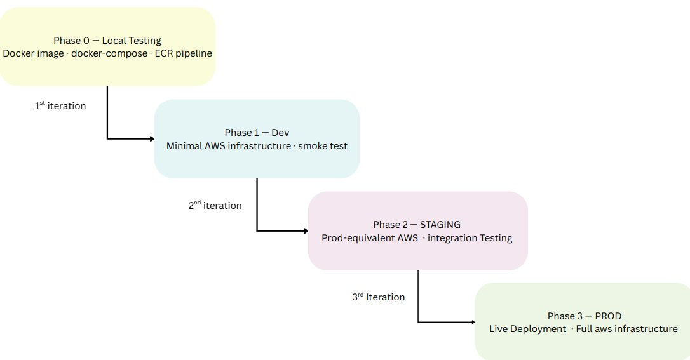
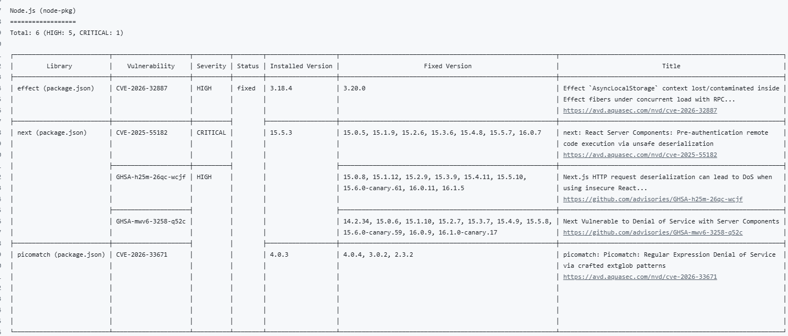

# Deployment Lifecycle

## Full Stack AWS Deployment — ECS Fargate, Terraform, CI/CD

The deployment is split into 4 phases. Phase 0 begins locally, running the Docker image and testing the prewritten docker-compose.yml to verify how the application operates. The remaining 3 phases are 3 iterative stages — dev, staging and prod — where the fully functional local application is migrated onto AWS infrastructure.

Repository: https://github.com/umami-software/umami

---

## Phases

| Phase | Environment | Goal                                           |
|-------|------------|------------------------------------------------|
| 0     | Local      | Validate application behaviour using Docker Compose |
| 1     | Dev        | Deploy minimal infrastructure and verify ECS service runs |
| 2     | Staging    | Test full architecture, integrations, and routing |
| 3     | Prod       | Deploy production setup with scaling, monitoring, and zero downtime |

---

## Phase 0 — Local Testing

Run the application locally using the prewritten docker-compose.yml to verify the application behaves as expected before moving to AWS.

### Pipeline Steps

1. Configure AWS access via OIDC — no hardcoded secrets or keys  
2. Build image  
3. Scan image  
4. Push to ECR  

### Docker Vulnerabilities

The Umami repository consisted of its own pre-built Dockerfile. The source code contained a TypeScript script which acts as middleware between components. As for this, I considered that containerising the application would cause future complications and instead, moved onto to optimizing build time on the dockerfile by adding caching layer and using trivy for scanning vulneberabilities which were found.

The issues detected were caused by outdated Node.js dependencies next, effect. Updating these packages in package.json resolved the reported CVEs, and rebuilding the image produced a clean scan.
(assests/ci_yml.png)

---

## Phase 1 — Dev

Smoke test — get the application running on minimal AWS infrastructure. The docker-compose.yml is used as the reference for the Terraform configuration and ECS task definition.

### Infrastructure Provisioned

| Resource            | Purpose                                      |
|--------------------|----------------------------------------------|
| VPC                | Public and private subnets                   |
| ECS Cluster        | Runs application containers                  |
| ECS Service        | Manages task scheduling                      |
| ECS Task Definition| Mirrors docker-compose.yml                   |
| RDS                | PostgreSQL database instance                 |
| IAM Role           | Grants ECS permission to pull image from ECR |
| Security Groups    | Controls traffic between services            |
| CloudWatch         | Log groups                                   |

---

## Phase 2 — Staging

Production-equivalent setup built on top of the dev stage. The aim is to catch any issues before prod.

### Added in This Stage

| Resource           | Purpose                                       |
|-------------------|-----------------------------------------------|
| ACM Certificate   | HTTPS on staging.umami-analytics.co.uk        |
| WAF               | AWS managed rule set attached to ALB          |
| Secrets Manager   | DB credentials with KMS encryption            |
| ALB Listener Rules| Routes /website* and /health to URL shortener |
| IAM Task Role     | S3 access and Secrets Manager permissions     |

---

## Phase 3 — Production

Full production setup with zero-downtime deployments, autoscaling and complete observability. Domain: umami-analytics.co.uk.

### Added in This Stage

| Resource                   | Purpose                                                              |
|---------------------------|----------------------------------------------------------------------|
| CodeDeploy                | Blue/green deployment with traffic control                           |
| Blue / Green Target Groups| Zero-downtime cutover, 5 min termination wait                        |
| Autoscaling               | Min 2 tasks, max 6 — CPU target 60%, memory target 70%               |
| CloudWatch Alarms         | ECS CPU/memory, ALB 5xx, ALB latency, RDS CPU, green TG healthy hosts|

### Pipeline Steps

1. Push to main triggers pipeline  
2. Build, scan and push image to ECR  
3. CodeDeploy provisions green task set  
4. Health checks pass — traffic shifts to green  
5. Blue task set terminated after 5 minute wait  
6. CloudWatch alarms monitor post-deploy  

### Autoscaling Thresholds

| Metric       | Scale Out             | Scale In                |
|--------------|----------------------|-------------------------|
| CPU          | 60%                  | Below 30% for 2 periods |
| Memory       | 70%                  | Same cooldown as CPU    |
| Cooldown out | 30s                  | —                       |
| Cooldown in  | 120s                 | —                       |

---

## Terraform Structure

| Module            | Purpose                                                      |
|------------------|--------------------------------------------------------------|
| networking        | VPC, subnets, route tables, security groups, NAT GW, IGW    |
| ecs               | ECS cluster, Umami service and task definition               |
| rds               | RDS PostgreSQL instance, subnet group, parameter group       |
| alb               | ALB, listeners, target groups and listener rules             |
| iam               | Task execution role, task role, CodeDeploy role and policies |
| cloudwatch        | Dashboard, log groups and alarms across ECS, ALB and RDS    |
| waf               | Web ACL, managed rule set and ALB association                |
| code_deployment   | CodeDeploy application and blue/green deployment group       |
| auto_scaling      | ECS service autoscaling policies and CloudWatch alarms       |
